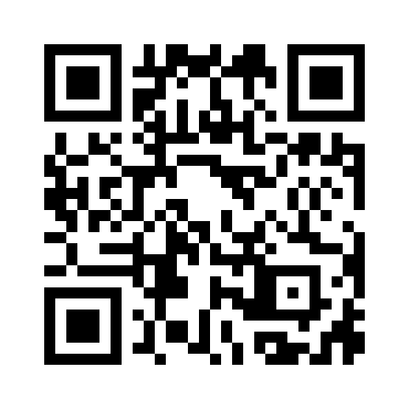
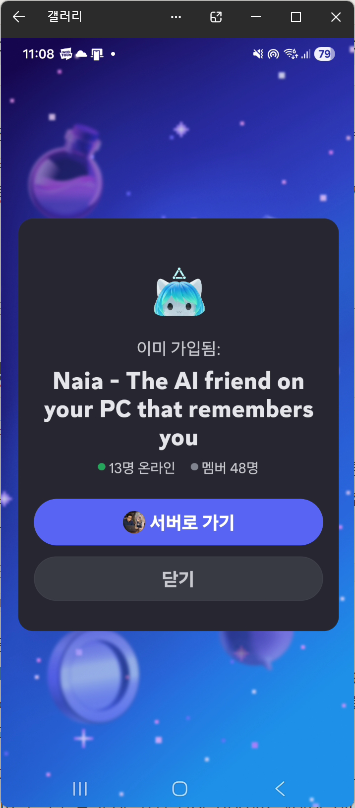
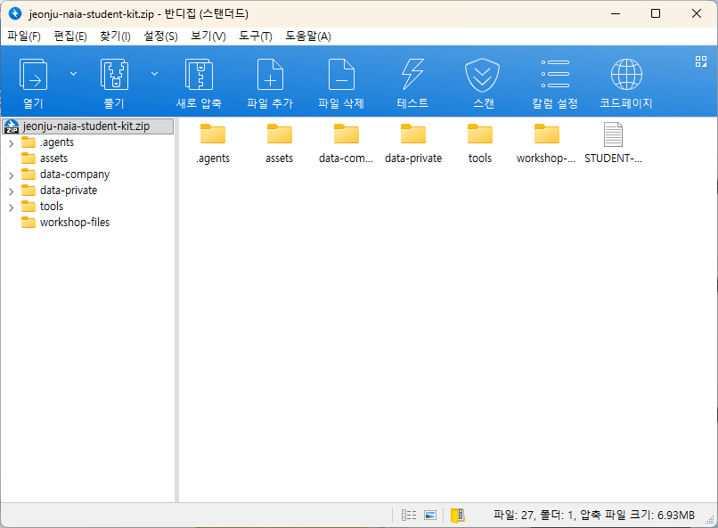

# 0. OT — 오늘 학습할 것 \[5분]

이 수업은 전북대학교·원광대학교 JST 공유대학 취·창업 동아리 참여자 25명을 대상으로 진행합니다.

## 먼저 할 일 1 — 수업 Discord 입장

[바이브 코딩 수업 Discord에 입장하기](https://discord.gg/7gtgcSRGE)

휴대전화 카메라로 QR 코드를 스캔하거나 위 링크를 누릅니다. 이 서버는 수업 공지와 질문을 위한 공간입니다.

수업 채널에는 교재 내용을 알고 있는 도우미 에이전트가 있습니다. 진행이 막히면 현재 장과 단계, 입력한 명령, 화면의 오류 문구를 보내 질문합니다. API 키와 봇 토큰은 보내지 않습니다.

> 4장에서 만드는 Discord 봇은 위 수업 서버가 아니라 학생 각자의 개인 실습 서버에 초대합니다.

## 먼저 할 일 2 — 학생용 실습 자료 받기

[전북대 학생용 실습 자료 ZIP 내려받기](https://github.com/nextain/naia-class/raw/refs/heads/main/jbnu-vibe-coding/jeonju-naia-student-kit.zip)

[수업 교재 PDF 내려받기](https://github.com/nextain/naia-class/raw/refs/heads/main/jbnu-vibe-coding/naia-jbnu-vibe-coding-workshop.pdf)

ZIP은 먼저 내려받아 둡니다. 1장에서 `naia-adk`를 내려받은 뒤, 2장에서 ZIP의 압축을 `%USERPROFILE%\naia-adk`에 한 번에 풉니다. ZIP 안에는 가상 회사 자료, 제안서·Discord 스킬, Discord 작업자, 공식 초기창업패키지 HWP 양식과 수업 Discord 참가 QR 이미지가 준비되어 있습니다.

압축을 풀면 QR 이미지는 `assets\discord-class-invite-qr.png`에서 다시 확인할 수 있습니다.

## 수업의 한 문장 목표

내 Windows 노트북에 AI 작업공간을 만들고, Claude Code에게 일을 맡긴 뒤, 외부에서는 Discord로 파일과 요청을 보내 결과를 받습니다.

## 오늘의 두 미션

### 미션 A · 홈페이지

* 입력: 가상 회사 소개, 브랜드 디자인 정보, PNG 이미지
* 작업자: 내가 직접 실행한 Claude Code
* 결과: Tailwind CSS 원페이지 홈페이지 `index.html`
* 확인: 로컬 브라우저와 GitHub Pages 공개 주소

### 미션 B · 제안서

* 입력: 초기창업패키지 HWP/HWPX 양식, 가상 회사 정보, 가상 대표자 정보
* 작업자: Discord를 감시하는 Claude Code
* 결과: 원본 양식 순서를 유지한 교육용 `HWPX` 제안서
* 확인: Discord에서 `HWPX` 결과 파일 다운로드

두 미션은 입력 목적과 결과물이 다릅니다. 홈페이지 미션이 HWP를 만들거나, 제안서 미션이 홈페이지를 만들게 하지 않습니다.

## 도구의 역할

| 도구              | 쉬운 설명                             | 오늘 하는 일            |
| --------------- | --------------------------------- | ------------------ |
| Git             | 파일 변경 이력을 남기는 도구                  | 홈페이지 변경 기록         |
| GitHub          | Git 저장소를 인터넷에 보관하는 서비스            | 홈페이지 저장과 공개        |
| GitHub Pages    | 저장소의 웹 파일을 홈페이지로 공개하는 기능          | 공개 URL 만들기         |
| naia-adk        | AI가 규칙·자료·기술을 함께 읽는 작업공간          | 회사 정보와 작업 규칙 제공    |
| Claude Code     | 대화하면서 파일을 읽고 고치는 CLI 작업자          | 홈페이지·문서 초안 작성      |
| Discord 봇       | Discord 메시지와 첨부파일을 프로그램에 전달하는 계정  | 원격 작업 창구           |
| 전북대학교 API 게이트웨이 | 학교가 여러 AI 모델을 하나의 접속 방식으로 제공하는 관문 | Claude Code의 모델 연결 |

## 95분 진행표

| 순서 | 내용               | 예상 시간 |
| -- | ---------------- | ----: |
| 0  | OT               |    5분 |
| 1  | 사전 설치            |   15분 |
| 2  | 가상 회사 정보·개인정보 입력 |   10분 |
| 3  | 홈페이지 제작·배포       |   15분 |
| 4  | Discord 연동       |   20분 |
| 5  | Discord HWPX 작업  |   20분 |
| 6  | Naia 소개          |   10분 |

예상 시간은 따라가기 위한 기준입니다. 늦어져도 수업 채널의 도우미 에이전트에게 물어보며 이어갈 수 있습니다.

## 저작권과 이용 조건

교재·설명문·교육용 이미지는 넥스테인 주식회사에 저작권이 있으며 [CC BY-NC 4.0](https://creativecommons.org/licenses/by-nc/4.0/deed.ko)에 따라 출처를 밝히면 인용·공유·비상업적 활용이 가능합니다. 유료 강의, 상업적 복제·배포 등 상업 이용은 넥스테인과 사전 협의해야 합니다.

실습 코드와 스크립트는 Apache License 2.0을 적용합니다. 정부기관이 제공한 공고·양식과 제3자 상표·화면 자료의 권리는 각 원저작자에게 있습니다.

## 수업이 끝났을 때 설명할 수 있어야 하는 것

* Git과 GitHub의 차이
* `data-company`와 `data-private`의 차이
* AI 요청문에 목적·자료·결과물·제약·검증을 써야 하는 이유
* 로컬 작업과 공개 배포의 차이
* Discord 봇 토큰을 비밀로 보관해야 하는 이유
* AI가 작성한 제안서를 사람이 근거와 양식으로 다시 확인해야 하는 이유
