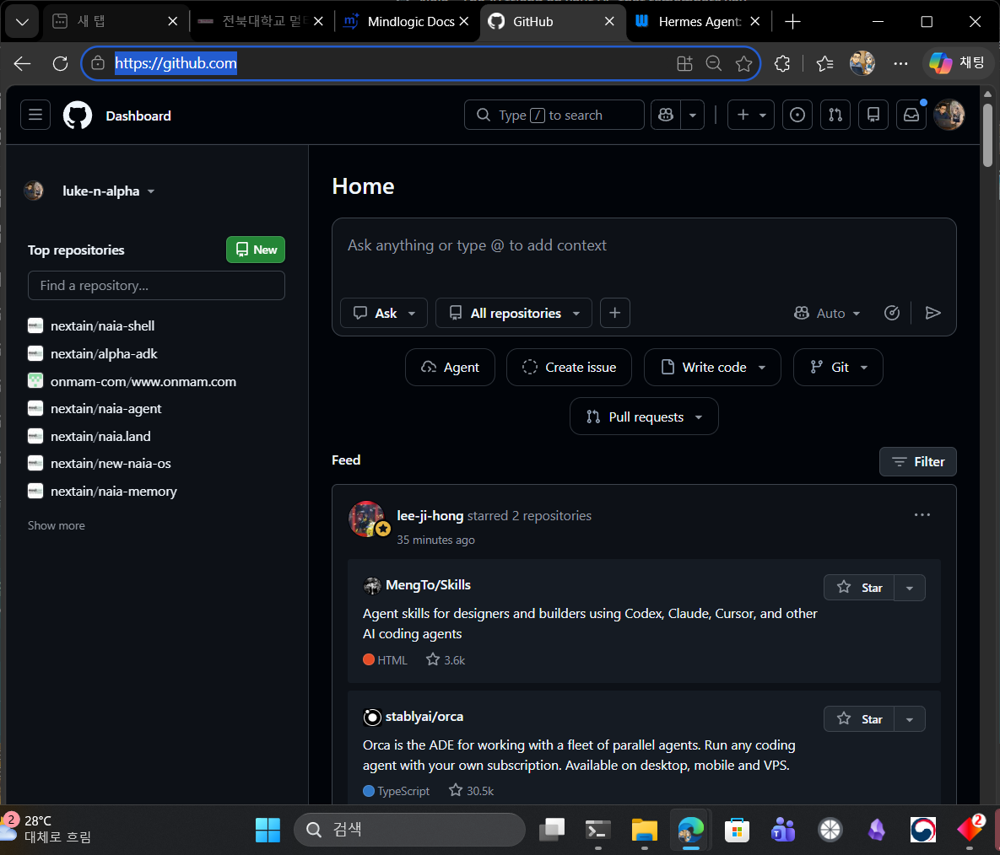
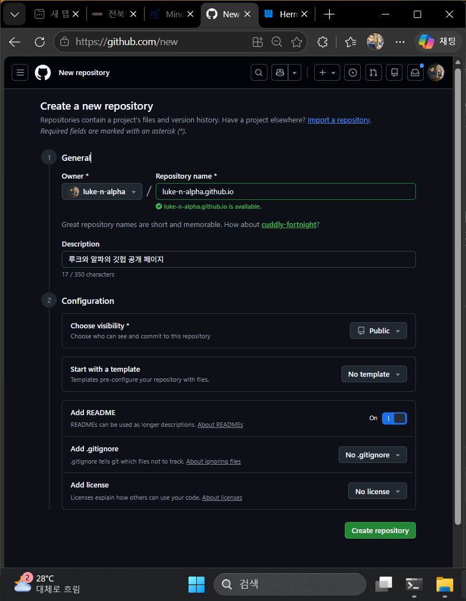
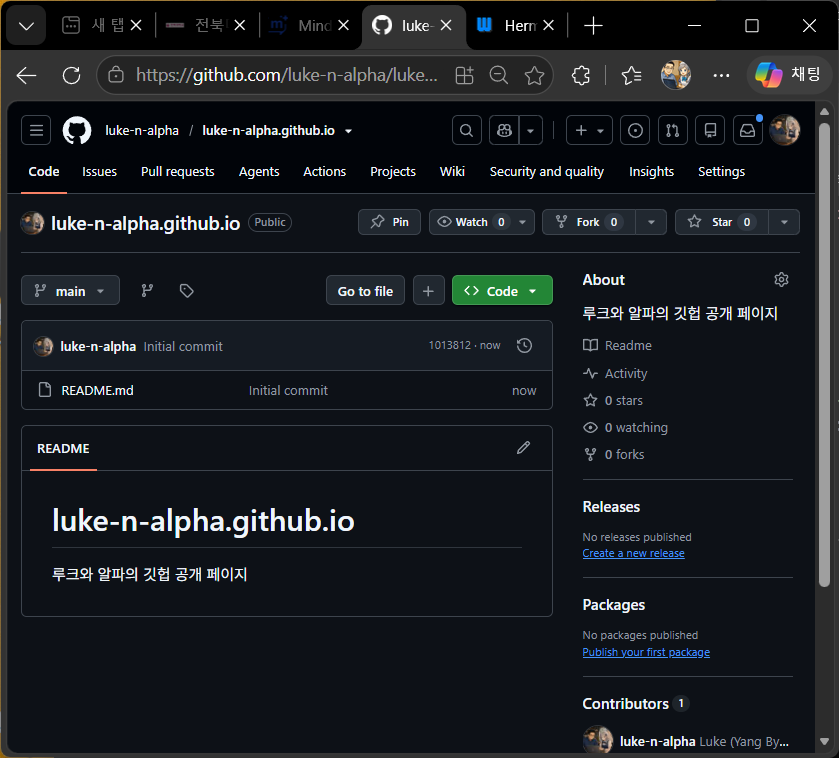
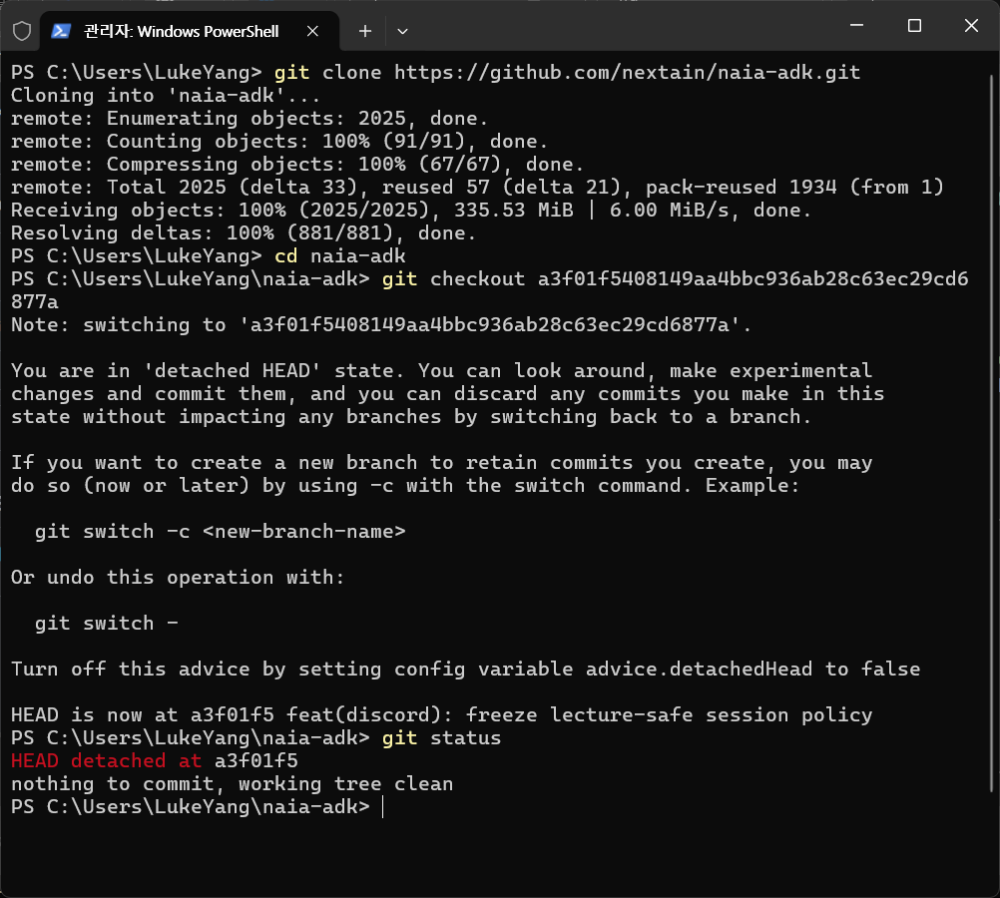
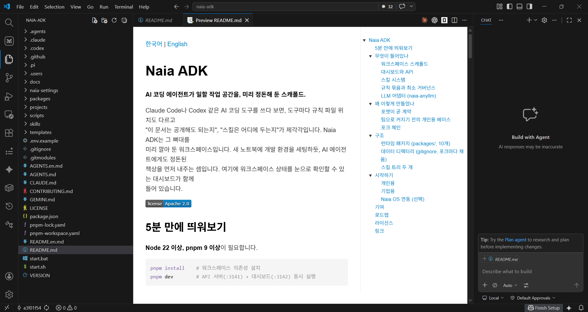
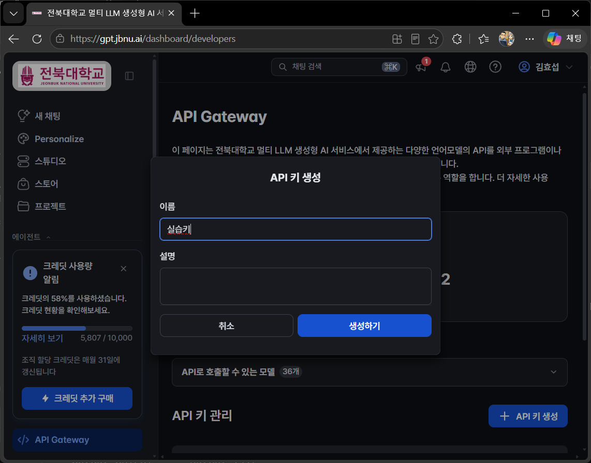

# 1. 사전 설치 \[15분]

## 목표

Git, GitHub 저장소, `naia-adk`, Claude Code를 준비하고 간단한 응답까지 확인합니다.

0장 OT에서 학생용 ZIP을 먼저 내려받아 둡니다. 이 장의 설치는 명령을 한 줄씩 복사해 PowerShell에 붙여 넣는 방식입니다.

## 1-1. PowerShell 열기

Windows 시작 메뉴에서 `PowerShell`을 검색해 엽니다. 명령을 복사한 뒤 PowerShell 터미널에서는 `Ctrl+Shift+V`를 눌러 붙여 넣고 Enter를 누릅니다. 설치가 끝난 뒤 명령을 찾지 못하면 PowerShell을 닫고 새로 엽니다.

&#x20;**여러분은 파워쉘(윈도우의 터미널) 환경을 오늘 주로 사용할 겁니다. 바이브 코딩은 본래 SW개발자들이 코딩을 하던 것을 의미합니다. 그리고 여러분이 사용하는 컴퓨터의 OS는 그래픽 UI의 뒤에는 텍스트명령어들로 동작합니다. 이러한 컴퓨터의 동작들의 규칙을 컴퓨터가 알아들을 수 있는 언어로 작성한 문서를 사실은 코드라고 합니다. 그리고 기존에는 이러한 코드의 작성은 SW개발자들이 했고, 그러한 코드를 실행은 보통 이런 텍스트 UI의 터미널 환경에서 동작을 기본으로 합니다. 또한 LLM, 곧 인공지능은 텍스트를 입력받고 출력하기 때문에 이러한 터미널환경에서 적은 데이터를 받아서 잘 동작합니다. 그래서 바이브 코딩 도구들은 대부분 이러한 터미널 환경에서 동작합니다.**&#x20;

&#x20;**물론 SW개발자가 될 것이 아니라면, 이러한 텍스트 UI의 명령어를 모두 알 필요는 없습니다. 하지만, 최근 여러분의 컴퓨터에 설치하고 AI에게 일을 시킬 수 있는 Agent들은 SW개발자들 중심으로 활용이 되었기 때문에 아직은 대부분 텍스트UI로 되어있습니다. 여러분의 학교에서 배포하는 AI계정을 활용해서도 이러한 Agent를 활용해 볼 수 있습니다.**&#x20;

&#x20;**가장 유명한 대표적인 Agent는 OpenClaw나 Hermes 에이전트입니다. 여러분이 가지고 계신 전북대 계정으로는 OpenClaw의 연동 가이드를 제공하고 있으니 나중에 활용해보셔도 좋습니다.**&#x20;

[**https://docs.mindlogic.ai/docs/jbnu/api-gateway/integrations/openclaw#openclaw-%EC%97%B0%EB%8F%99**](https://docs.mindlogic.ai/docs/jbnu/api-gateway/integrations/openclaw#openclaw-%EC%97%B0%EB%8F%99)

**요즘 가장 유행하는 에이전트로는 헤르메스가 있습니다. 위키독스에 무료로 공개된 책도 있으니 관심 있으면 역시 활용해 보셔도 좋습니다.**

[**https://wikidocs.net/book/19414**](https://wikidocs.net/book/19414)&#x20;

&#x20;오늘 수업은 OpenClaw나 헤르메스가 아닌 Claude Code를 에이전트로 활용할 수 있는 방법을 설명드리려고 합니다. 왜냐하면 오늘 수업은 코드를 만드는 바이브 코딩 수업이고, 가장 강력한 에이전트, 그리고 가장 강력한 모델을 값싸게 사용하실 수 있는 방법은 코딩에이전트 이기 떄문입니다.

&#x20;SW개발자들이 사용하는 Coding Plan의 구독제에서 200$ 의 매우 고가지만,  보통 사용하는 20$대비 20배의 사용량을 제공하며 최고성능 모델을 먼저 사용하게 해주기에 하루종일 만약 무언가를 돌려야 한다면 이를 이용할 수 밖에 없습니다. 최근 open weight (오픈소스 모델)로 고가의 개인 GPU에서 구동 가능한 모델도 있지만, 성능은 온라인 구독 대비 떨어집니다.

## 1-2. 오픈소스 운영 SW, Git 설치

```powershell
winget install --id Git.Git -e --source winget
git --version
```

위 명령어를 파워쉘에 복붙하시면 git이 설치 되고 버전을 확인해볼 수 있습니다.

Git은 파일을 인터넷에 올리는 도구가 아니라, 파일이 언제 어떻게 달라졌는지 기록하는 도구(소프트웨어)입니다. 또한 다음 사용하는 Github 플랫폼에 내 코드를 올리고 받고 혹은 다른 사람들과 협업하는 도구로 사용됩니다. 사용법을 모두 알려드리기는 어렵고 뒤에서 사용하며 간략히 설명 드리겠습니다. 그리고 다음은 깃허브 플랫폼에서 페이지 저장소를 만들어봅시다. 이걸로 무료 홈페이지를 공개할 수 있습니다.

## 1-3. 오픈소스 플랫폼 GitHub의 Pages 저장소 만들기

1. 브라우저에서 GitHub (https://github.com/) 에 로그인합니다.
2. 오른쪽 위 `+` → `New repository`를 누릅니다.
3. 저장소 이름은 `<내 GitHub 아이디>.github.io`로 입력합니다
4. `Public`을 선택합니다.
5. `Add a README file`을 선택하고 저장소를 만듭니다.
6. 저장소의 초록색 `Code` 버튼에서 HTTPS 주소를 복사합니다

GitHub Pages는 이 저장소의 HTML 파일을 웹사이트로 보여주는 공개 홈페이지를 제공합니다.



## 1-4. 오픈소스 AI작업공간 naia-adk 다운로드

naia-adk 는 제가 만든 ai와 일하는 작업공간 오픈소스 프로젝트 입니다. naia는 openclaw나 herems 혹은 claude code와 같은 naia-agent, 그리고 UI인 naia-shell로 이루어져 있습니다. 오늘 실습에 naia-shell까지 있었다면 윈도우 UI로 실습할 수 있었을텐데 거기까지 개발을 못해서 오늘은 naia-adk만 가지고 수업을 합니다. naia-adk는 naia-agent 뿐만 아니라 claude code, codex, opencode와 같은 일반적인 AI Agent의 표준을 따른 작업 공간으로 오늘 실습은 claude code로 합니다.

```powershell
cd ~
git clone https://github.com/nextain/naia-adk.git
cd naia-adk
git checkout a3f01f5408149aa4bbc936ab28c63ec29cd6877a
git status
```

`naia-adk`는  AI가 일할 때 필요한 규칙, 기술 사용법, 회사 자료와 개인 자료, 프로젝트를 한 작업공간의 오픈소스입니다. 이번 수업에서는 내려받은 상태를 기준으로 사용하며 업데이트하거나 내부 코드를 수정하지 않습니다.



위처럼 나오면 잘 받아진겁니다.&#x20;

`AGENTS.md`는 AI 작업 규칙을 기록하는 공통 표준 파일입니다. 이 파일에는 AI가 사용할 수 있는 도구, 작업 순서, 주의할 점과 필요한 스킬의 위치가 적혀 있습니다.

AI 도구마다 자동으로 읽는 파일 이름은 다릅니다. Claude Code는 `CLAUDE.md`, Gemini CLI는 `GEMINI.md`를 읽습니다. `naia-adk`의 `AGENTS.md`, `CLAUDE.md`, `GEMINI.md`에는 같은 작업 규칙이 들어 있으므로, 어떤 AI 도구로 시작하더라도 같은 작업공간을 사용할 수 있습니다. 이번 수업에서는 Claude Code가 `CLAUDE.md`를 자동으로 읽으므로 학생이 프롬프트로 다시 읽으라고 지시하지 않아도 됩니다.

Naia ADK는 Discord 연결, HWP 처리, 소프트웨어 개발 절차와 스킬을 한곳에 모아 둔 AI 작업공간입니다. 계속 사용하면서 본인에게 필요한 회사 자료와 스킬을 추가하거나 수정할 수 있습니다.



Naia-ADK에서 알면 좋은 주요 파일과 폴더의 위치는 다음과 같습니다. Naia의 경우 다른 ADK와 달리 다중 프로젝트를 동시에 사용하게 하고, 제가 사용하기 위해 1인 창업자를 위한 소규모 기업용의 스킬들을 가지고 있고, 각 데이터들은 별도의 폴더에 저장하여 서브모듈로 관리하고 있습니다. 서브모듈 관리의 상세 방법은 오늘 수업에서는 다루지 않습니다. 이는 Git의 사용법을 좀 더 공부해보시거나 설치후 Claude Code에게 물어보시면 답변을 해 줄 겁니다.

| 위치               | 역할                         |
| ---------------- | -------------------------- |
| `AGENTS.md`      | 여러 AI 도구가 함께 사용하는 표준 작업 규칙 |
| `CLAUDE.md`      | Claude Code가 자동으로 읽는 작업 규칙 |
| `GEMINI.md`      | Gemini CLI가 자동으로 읽는 작업 규칙  |
| `.agents/skills` | 문서 읽기와 프로젝트 생성 같은 작업 절차    |
| `data-company`   | 팀과 공유 가능한 회사 자료            |
| `data-private`   | 공개하거나 Git에 올리면 안 되는 개인 자료  |
| `projects`       | 실제 결과물을 만드는 프로젝트 폴더        |

## 1-5. 코딩 에이전트 Claude Code 설치

Discord 작업자와 HWP 읽기에 필요한 Node.js, Python, pyhwp도 함께 설치합니다. 저 같은 경우 각종 도구를 직접 설치하기 보다는 Claude Code나 Codex를 설치하기 위해 Node.js 와 Claude Code를 설치 후 나머지의 설치를 요청합니다. 그러나, 빠른 수업을 위해 아래의 명령어를 복붙하여 설치하세요. 저는 이미 설치되어있습니다.

Node.js는 Discord 감시 프로그램을 실행하고, Python과 pyhwp는 HWP 문서에서 글을 꺼낼 때 사용합니다.

```powershell
winget install Anthropic.ClaudeCode
Set-ExecutionPolicy -ExecutionPolicy RemoteSigned -Scope CurrentUser
claude --version
```

Set-ExecutionPolicy -ExecutionPolicy RemoteSigned -Scope CurrentUser 이후 뭔가 물어보면 Y를 입력하고, claude --version 해서 claude code 의 버전 숫자가 나오면 정상 설치된겁니다.

## 1-6. 전북대 AI API 연결과 Claude Code 설정

아래의 URL을 입력하여 API키를 발급합니다. 클로드 코드의 경우 클로드 구독을 해서 보통 사용 하지만, 여러분은 학교의 지원으로 API를 통해 클로드를 이용할 수 있습니다.&#x20;

## [https://gpt.jbnu.ai/dashboard/developers](https://gpt.jbnu.ai/dashboard/developers)



적절한 이름을 넣고 생성하면 키가 발급됩니다. 이 키는 다음 시간에도 자동으로 적용되도록 Claude Code의 프로젝트별 개인 설정 파일에 저장합니다.

```powershell
cd ~/naia-adk
notepad .claude\settings.local.json
```

파일을 새로 만들 것인지 물으면 `예`를 누릅니다. 메모장이 열리면 아래 내용을 붙여 넣습니다. 두 곳의 `발급받은키`를 실제 발급받은 키로 바꾸고 저장한 뒤 메모장을 닫습니다. 큰따옴표와 쉼표를 지우지 마세요.

```json
{
  "env": {
    "JBD_KEY": "발급받은키",
    "ANTHROPIC_BASE_URL": "https://factchat-cloud.mindlogic.ai/v1/gateway/claude",
    "ANTHROPIC_AUTH_TOKEN": "발급받은키"
  }
}
```

`.claude\settings.local.json`은 이 PC의 이 프로젝트에서만 사용하는 Claude Code 설정입니다. Claude Code가 시작할 때 이 파일을 자동으로 읽으므로 PowerShell을 다시 열어도 별도의 환경변수 명령을 실행할 필요가 없습니다. 이 파일에는 발급받은 키가 있으므로 GitHub나 Discord에 올리지 않습니다.

```powershell
claude -p "응답을 JBD_CLAUDE_OK 한 줄로만 해줘" --model claude-sonnet-4-6 --output-format json --max-turns 1 --no-session-persistence
```

결과 안에 `JBD_CLAUDE_OK`가 보이면 연결 성공입니다.

> 화면 캡처 위치: API 키가 보이지 않도록 가린 뒤 `JBD_CLAUDE_OK` 결과만 보이는 PowerShell

## 완료 확인

* [ ] `git --version`이 버전을 표시한다.
* [ ] `<내 아이디>.github.io` 저장소가 생성되었다.
* [ ] `$HOME\naia-adk\AGENTS.md`가 존재한다.
* [ ] `claude --version`이 버전을 표시한다.
* [ ] Claude Code가 `JBD_CLAUDE_OK`로 응답한다.
