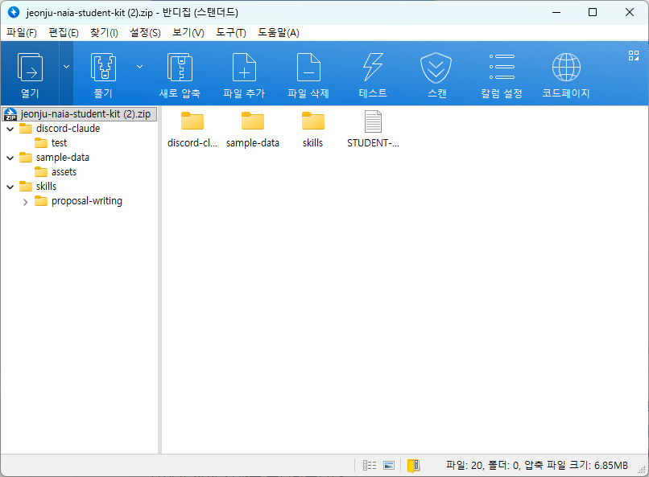

# Discord와 Claude Code로 운영하는 원격 AI 작업실

## 전북대학교·원광대학교 JST 공유대학 취·창업 동아리 실습

참여자 25명 · 깨끗한 Windows 노트북에서 시작하기

## 수업 Discord 입장

[바이브 코딩 수업 Discord에 입장하기](https://discord.gg/7gtgcSRGE)

휴대전화 카메라로 QR 코드를 스캔하거나 위 링크를 누릅니다. 이 주소는 공지와 질문을 위한 수업 서버 초대 링크입니다.

&#x20;수업 채널에는 교재 내용을 알고 있는 도우미 에이전트가 있으므로, 진행이 느리거나 오류가 생기면 현재 단계와 화면의 오류 문구를 그대로 질문해주세요

## 학생용 실습 자료

[전북대 학생용 실습 자료 ZIP 내려받기](https://github.com/nextain/naia-class/raw/refs/heads/main/jbnu-vibe-coding/jeonju-naia-student-kit.zip)

ZIP은 먼저 내려받아 둡니다. 1장에서 `naia-adk`를 내려받은 뒤, 2장에서 ZIP의 압축을 `%USERPROFILE%\naia-adk`에 한 번에 풉니다. ZIP 안에는 가상 회사 자료, 제안서·Discord 스킬, Discord 작업자와 공식 초기창업패키지 HWP 양식이 알맞은 구조로 준비되어 있습니다. 파일을 하나씩 옮기거나 설치 스크립트를 실행할 필요가 없습니다.

오늘의 수업목표는 가상의 회사 자료를 `naia-adk`에 정리하고, Claude Code에게 홈페이지를 만들게 한 뒤 GitHub Pages에 직접 배포하고, 마지막에는 Windows 노트북에서 Discord를 감시하는 작업자를 실행해, 원격으로 초기창업패키지 HWP 양식을 보내고 작성 결과를 돌려받는것을 목표 합니다.&#x20;

&#x20;이 교재의 모든 회사명·인명·연락처·주소·실적·이미지는 교육용 가상 정보입니다. 이 실습을 통해 자유롭게 고쳐서 응용해보실 수 있습니다.&#x20;

&#x20;보안에 주의하실 점은 실습 중 API 키와 Discord 봇 토큰을 문서, 화면 캡처, Discord 메시지, Git 저장소에 올리지 않도록 하세요. 올리시면 사용하시는 AI(Claude Code)가 올리지 말라고 하거나, Git에서 나중에 경고를 보내는 등의 안전 장치가 있지만, 원칙적으로 보안에 문제가 될 수 있는 key는 Git에 올리지 않습니다.

&#x20;또한 AI Chat(Claude)에게도 직접 전달하지 않습니다. 그렇게 하지 않아도 key를 사용할 수 있는데 자세한 실습 방법은 뒤에서 진행 할겁니다.

## 저작권과 이용 조건

교재·설명문·교육용 이미지는 넥스테인 주식회사에 저작권이 있으며 [CC BY-NC 4.0](https://creativecommons.org/licenses/by-nc/4.0/deed.ko)에 따라 출처를 밝히면 인용·공유·비상업적 활용이 가능합니다. 유료 강의, 상업적 복제·배포 등 상업 이용은 넥스테인과 사전 협의해야 합니다.

실습 코드와 스크립트는 Apache License 2.0을 적용합니다. 정부기관이 제공한 공고·양식과 제3자 상표·화면 자료의 권리는 각 원저작자에게 있습니다.

## 오늘 완성할 것

1. `naia-adk` 안에 정리된 가상 회사 자료와 가상 개인정보
2. Tailwind CSS로 만든 가상 회사 원페이지 홈페이지
3. GitHub Pages에 공개된 홈페이지 주소
4. 내 Discord 채널의 요청을 받는 Claude Code 작업자
5. Discord로 HWP 양식을 보내 받아보는 교육용 `HWPX` 제안서

## 실습 흐름

`수업 채널 입장 → 설치 → 정보 정리 → 홈페이지 제작·배포 → 개인 Discord 서버 연결 → HWPX 원격 작업 → Naia 소개`

> 홈페이지 제작과 HWP 제안서 작성은 서로 다른 미션입니다. 먼저 로컬에서 홈페이지 제작과 배포를 끝내고, 그 다음 Discord 원격 작업으로 HWP 제안서를 작성합니다.
